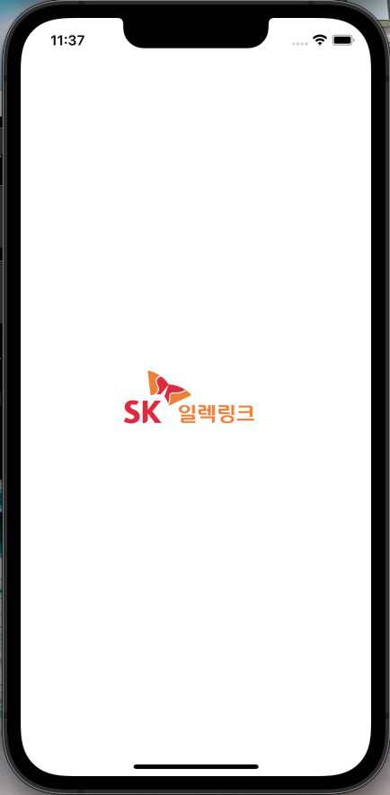
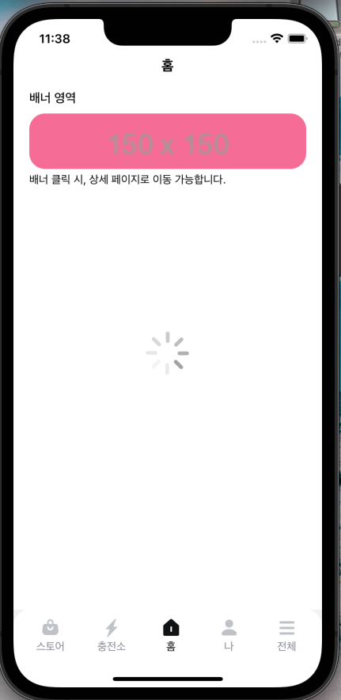
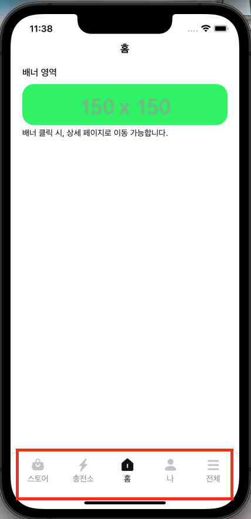
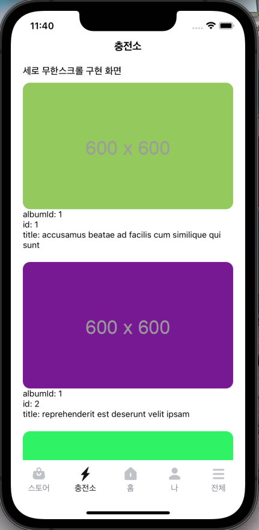
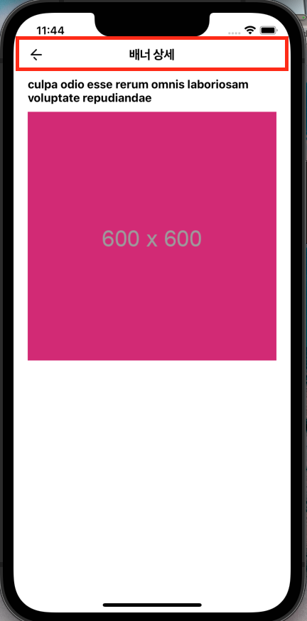

# sk_electlink_test

SK 일렉링크 과제

## 제출자 정보

- 지원 포지션 : 사용자 앱 개발자
- 제출자 : 김례원

## 실행 CLI

```bash
yarn run start --reset-cache

# ios simulator 실행 시
yarn ios

# android emulator 실행 시
yarn android
```

## 사용 라이브러리

- React Native : 0.72.1
- Redux : 8.1.1
- Redux Saga : 1.2.3
- Redux Persist : 6.0.0
- React Navigation : v6
  - Naitve
  - Bottom Tabs
  - Stack
- React Native FastImage
- Lottie React Native
- TypeScript
- 그 외 : eslint, prettier, axios

---

## 구현 기능

| 구현 기능                                                                                  |                              화면                               |
| :----------------------------------------------------------------------------------------- | :-------------------------------------------------------------: |
| Lottie 적용1(Splash)                                                                       |     |
| Lottie 적용2(Loading)                                                                      |   |
| Bottom Tab <br> (자사 앱의 Tab Bar 참고하여 구성)                                          |   |
| Flicking 가로 배너                                                                         | ! |
| 세로 무한 스크롤                                                                           |   |
| Stack Navigation을 활용한 상세 페이지 이동 <br> (홈 화면의 배너 클릭 시 상세화면으로 이동) |   |
| 공통 헤더                                                                                  |   |

---

## 프로젝트 구조

- src
  - assets : 이미지나 lottie와 같은 필요 asset
    - images
    - lottie
  - components : 공통으로 사용하기 위한 컴포넌트
    - CustomHeader : 헤더 컴포넌트
    - Loadng : API 호출 시, 띄우기 위한 Loading 컴포넌트
  - container : 화면 UI(Bottom Tab Bar 기준)
    - Store : 스토어
    - ChargingStation : 충전소
    - Home : 홈
    - My : 마이
    - Total : 전체
  - navigators : 화면 이동을 위한 Navigator
    - CustomTabBar : 하단 탭바 디자인 커스텀
    - BottomNavigator.tsx : 하단 탭바 Navigator
    - MainNavigator.tsx : 화면 Stack을 쌓기 위한 Stack Navigator
    - RootNavigator.tsx : 화면 이동을 관리하기 위한 Root Navigator
  - sagas
    - CommonSaga.ts : 앱 전반에 공통으로 사용될 state를 관리하기 위한 saga
    - ChargingStationSaga.ts : 충전소 탭 영역에서 필요한 saga(세로 무한스크롤 데이터 호출)
    - HomeSaga.ts : 홈 탭 영역에서 필요한 saga(가로 배너 데이터 호출)
    - index.ts : 전체 saga 관리
  - stores
    - Common : 앱 전반에 공통으로 사용할 state store
    - ChargingStation : 충전소 탭 영역에서 사용할 state store
    - Home : 홈 탭 엽역에서 사용할 state store
    - CreateStore.ts
    - index.ts
  - services
    - Axios.ts : 현재 프로젝트에서 사용할 GET Axios 커스텀
    - NavigationService.ts : 화면 이동을 위한 Navigator 커스텀
    - UserService.ts
