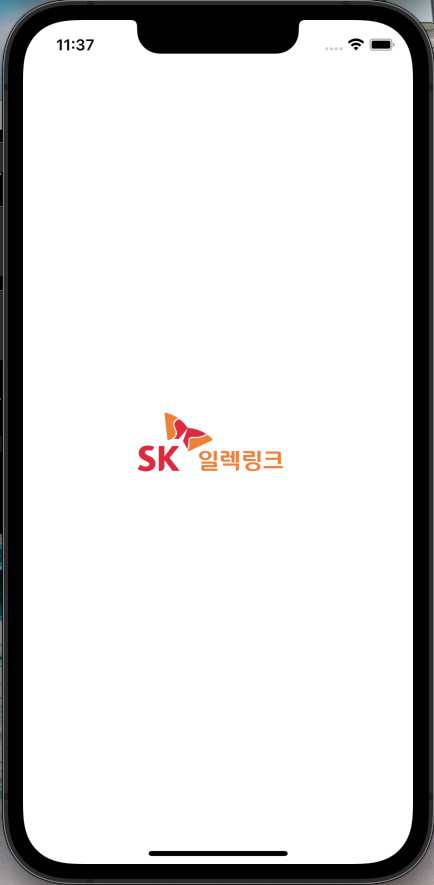
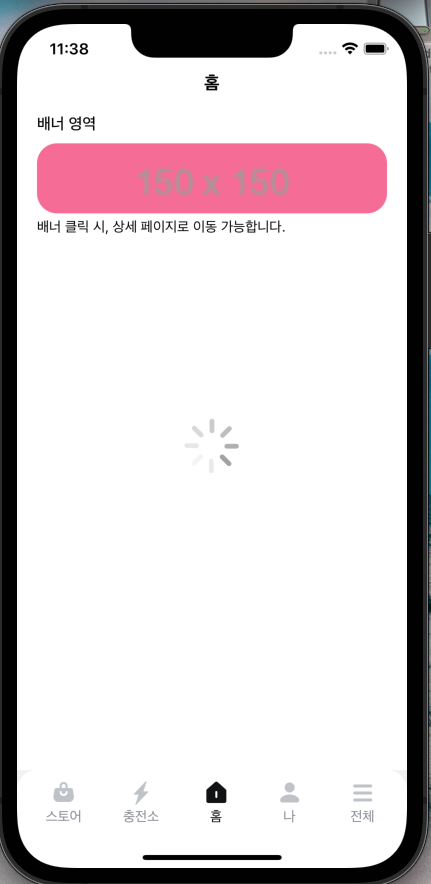
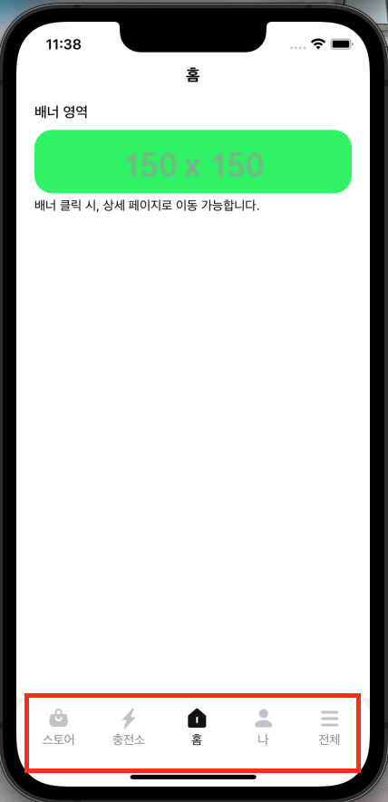
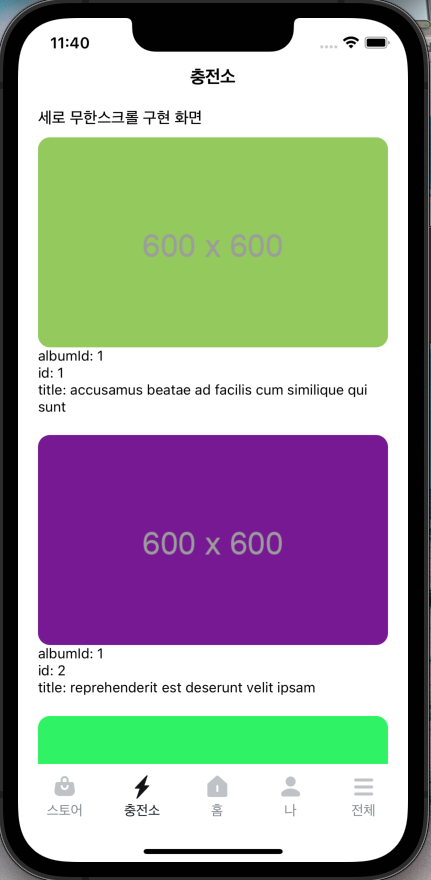
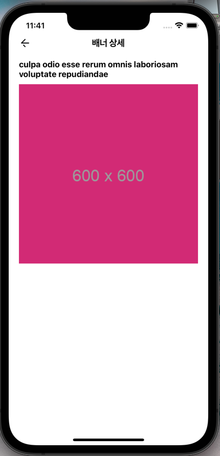
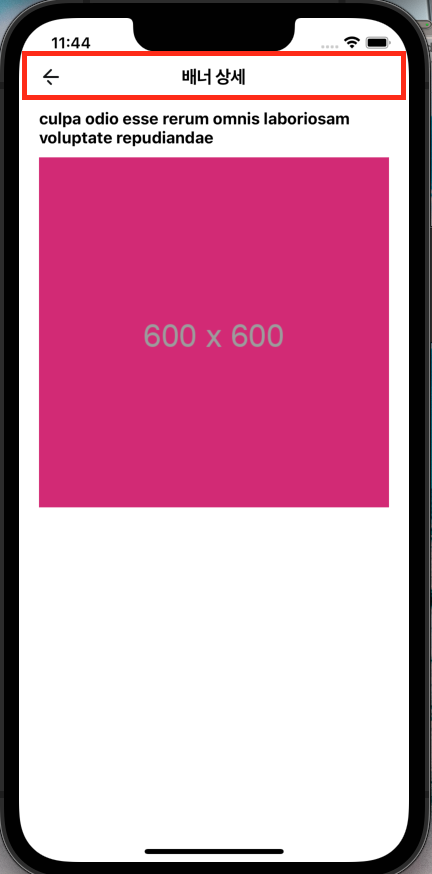

# sk_electlink_test

SK 일렉링크 과제

## 제출자 정보

- 지원 포지션 : 사용자 앱 개발자
- 제출자 : 김례원

## 사용 라이브러리

- React Native : 0.72.1
- Redux : 8.1.1
- Redux Saga : 1.2.3
- Redux Persist : 6.0.0
- React Navigation : v6
  - Naitve
  - Bottom Tabs
  - Stack
- React Native FastImage
- Lottie React Native
- TypeScript
- 그 외 : eslint, prettier, axios

---

## 구현 기능

| 구현 기능                                                                                  |           화면           |
| :----------------------------------------------------------------------------------------- | :----------------------: |
| Lottie 적용1(Splash)                                                                       |    |
| Lottie 적용2(Loading)                                                                      |  |
| Bottom Tab                                                                                 |  |
| Flicking 가로 배너                                                                         |  |
| 세로 무한 스크롤                                                                           |  |
| Stack Navigation을 활용한 상세 페이지 이동   (홈 화면의 배너 클릭 시 상세화면으로 이동) |  |
| 공통 헤더                                                                                  |  |

---

## 프로젝트 구조

- src
  - assets
    - images
    - lottie
  - components
    - CustomHeader
    - Loadng
  - container
    - Store
    - ChargingStation
    - Home
    - My
    - Total
  - navigators
    - CustomTabBar
    - BottomNavigator.tsx
    - MainNavigator.tsx
    - RootNavigator.tsx
  - sagas
    - CommonSaga.ts
    - ChargingStationSaga.ts
    - HomeSaga.ts
    - index.ts
  - stores
    - Common
    - ChargingStation
    - Home
    - CreateStore.ts
    - index.ts
  - services
    - Axios.ts
    - NavigationService.ts
    - UserService.ts
